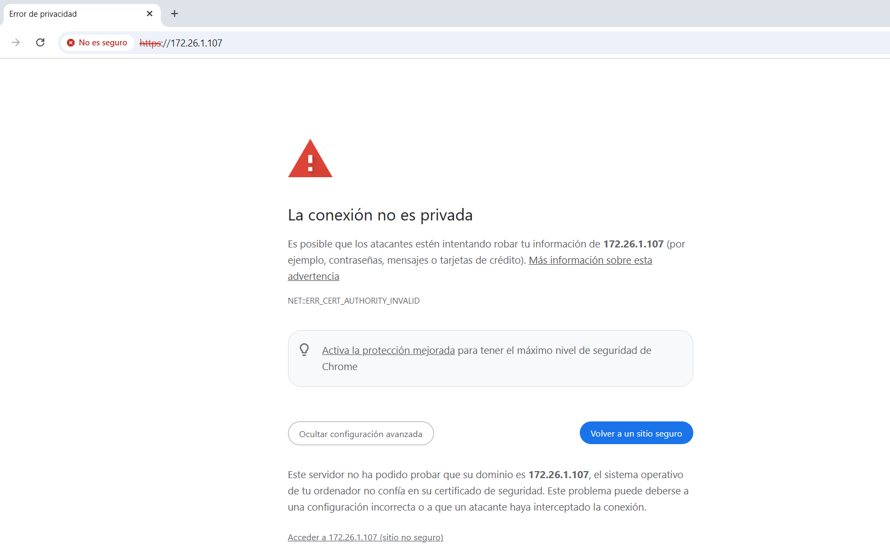
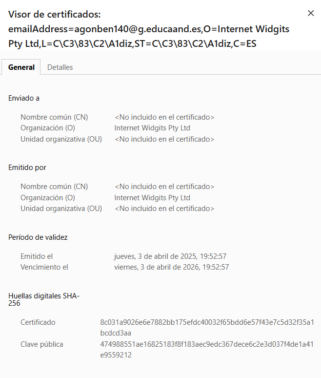
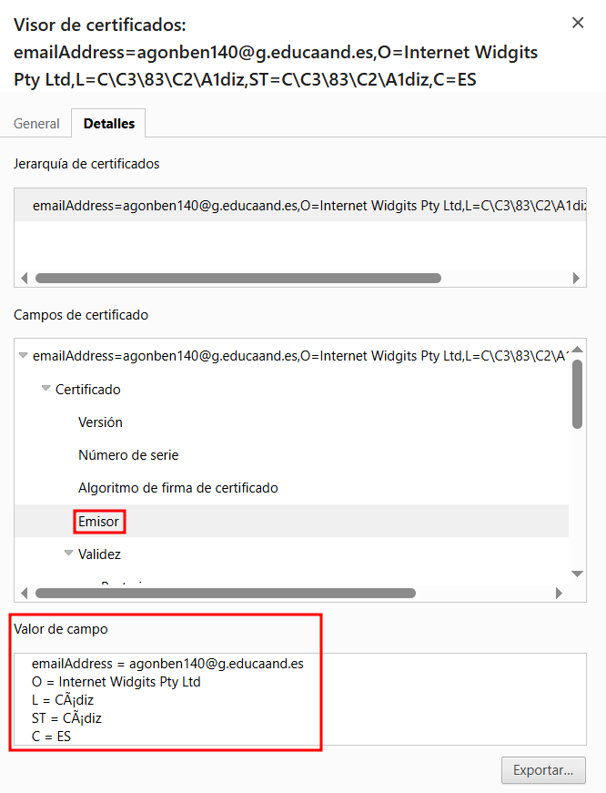
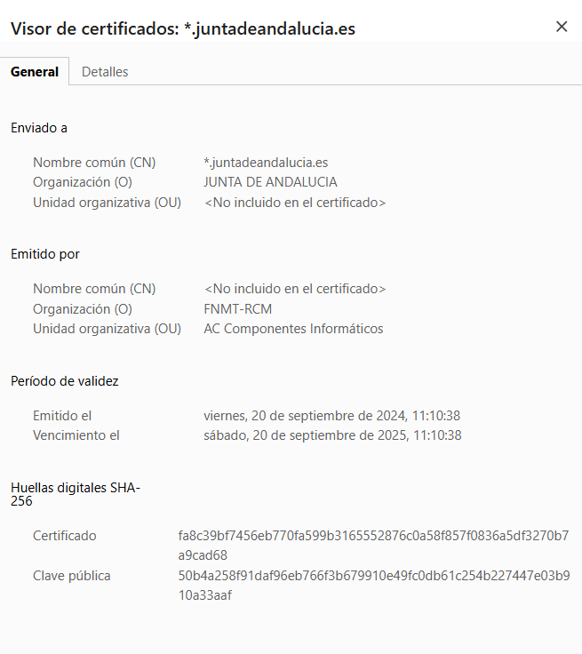
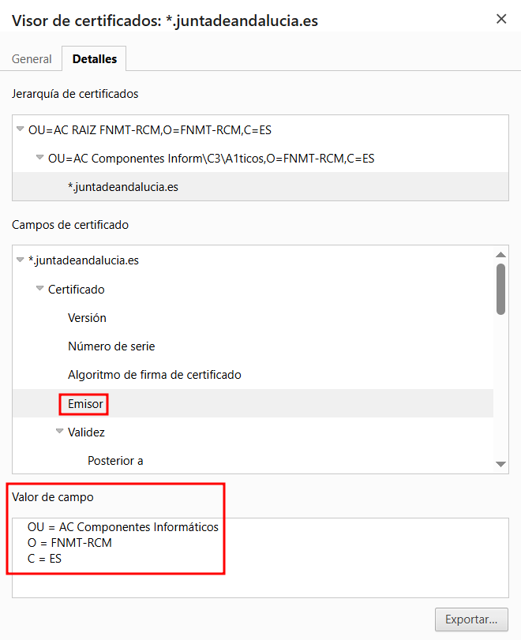

# Comparativa entre certificados

## Imagen del error del certificado autofirmado

Al entrar en la url del servidor web por https aparece el siguiente error

## Detalles del certificado autofirmado

## Detalles del certificado verídico

## Diferencias

La principal diferencia a simple vista radica en los emisores de los cerificados, en el [certificado autofirmado](#detalles-del-certificado-autofirmado) el emisor no es una entidad autorizada de confianza para el navegador, mientras que en el [certificado verídico](#detalles-del-certificado-verídico) el emisor es la Fabrica Nacional de Moneda y Timbre ([FNMT](https://www.fnmt.es/home)).