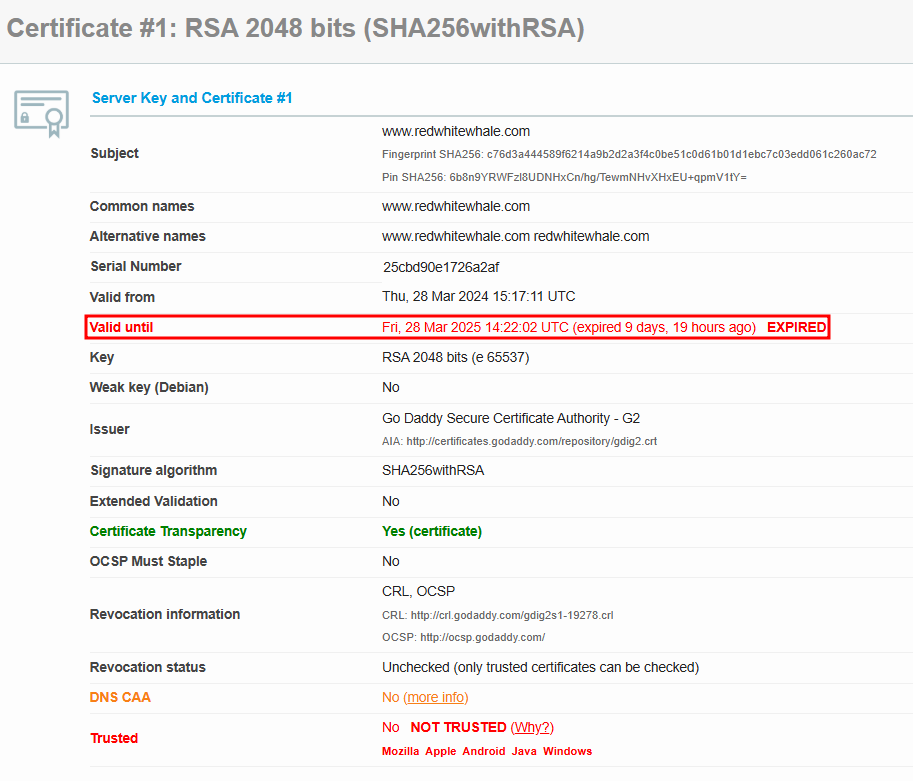
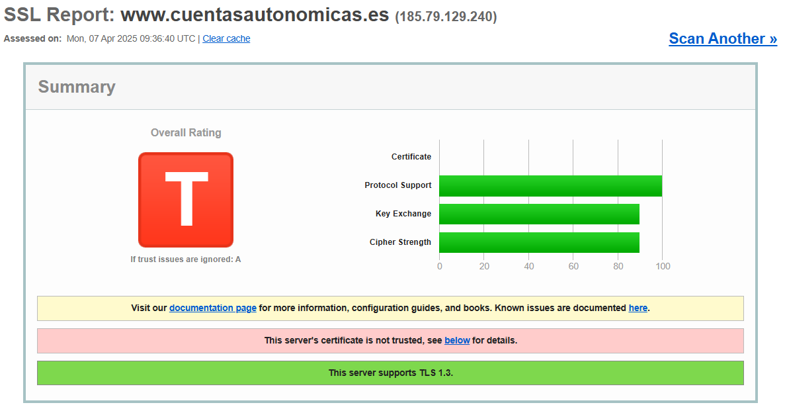

# Comparativa de certificados con SSLLabs

## Detalles del certificado verídico

Para el ejemplo de certíficado verídico se ha escogido la web de Github.

El certificado es válido ya que:

* Está atribuido al mismo dominio
* No ha expirado
* Tiene certificado de transparencia

* Está certificado por una entidad de confianza

## Detalles de los cerificados inválidos

### Certificado 1

Este cerificado no es válido ya que está expirado

## Certificado 2

Este cerificado no es válido ya que :

- Ocurre un error al comprobar el nombre alternativo
- El hash SHA256 con el correspondiente al certificado enviado por servidor no es válido

## Certificado 3

Este certificado no es válido ya que :

- No existe una cadena de confianza que certifique que es está emitido por una entidad de confianza

